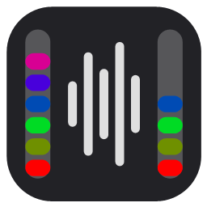

# SoundRadar for Windows

Two bars on the left and right edges of your screen that show where sound is coming from.

It's made for people who are deaf or hard of hearing in one ear. You can turn on Windows
**Mono audio**, so you hear everything in your good ear, and the bars still show which side
a sound came from. That's useful for footsteps and gunfire in games. SoundRadar started
life as two Arduino-driven LED strips; this is the desktop version.



## Why it works with Mono audio

Most audio visualizers read the finished mix that goes to your speakers. When Mono audio
is on, Windows has already merged left and right by that point, so both sides look the
same. SoundRadar reads each app's audio before that merge, using process loopback
capture, so it still sees the real left/right difference.

## Requirements

- Windows 10 version 2004 (May 2020) or newer, or Windows 11. Older versions still work,
  but lose the stereo image when Mono audio is on.
- Nothing else to install: the app uses .NET Framework 4.8, which is built into Windows.

## Install

Download `SoundRadar-Setup-<version>.msi` from
[Releases](https://github.com/JStein92/sound-radar-windows/releases) and run it.

- **Unsigned-installer warning:** the installer isn't code-signed yet, so Windows may show
  "Windows protected your PC". Click **More info → Run anyway**.
- **No admin prompt:** it installs for your user only, to
  `%LocalAppData%\Programs\SoundRadar`, and adds a Start menu shortcut.
- **Upgrades:** installing a newer version replaces the old one.
- **Uninstall:** use **Settings → Apps**.

## Using it

The settings window opens when SoundRadar starts. Closing it leaves the bars running, and
the tray icon brings it back.

- **Audio source:**
  - **All apps:** everything you hear.
  - **One app only:** just the game, so voice chat doesn't move the bars.
  - **Output device:** the old method, which Mono audio flattens.
- **Response:**
  - **Sensitivity**, or turn on **Auto sensitivity**.
  - **Boost quiet sounds** makes quiet sounds like footsteps register next to loud ones.
  - **Radar** lights only the louder side, by how much louder it is.
- **Look (saved per profile):**
  - **Color:** 9 color schemes.
  - **Mode:** fill from the bottom, fill from the top, or grow from the center.
  - **Segments:** an LED-strip look, or 0 for a smooth bar.
  - **Brightness.**
  - **Background:** a dark backing so the bars show on bright screens.
- **Placement:**
  - **Monitor:** a specific display, or **All displays** to put the bars on the outer
    edges of a multi-monitor setup.
  - **Width, length, and gap** from the screen edge.
- **Profiles:** 9 of them.
- **Hotkeys:** optional, and they work while a game has focus.
- **Start with Windows:** a checkbox at the bottom of the settings window.

The bars only show over games running in **windowed or borderless fullscreen**. Exclusive
fullscreen hides every other window. If a game runs as administrator, Windows won't pass
SoundRadar's hotkeys through while that game has focus.

Settings are stored in `%APPDATA%\SoundRadarDesktop`.

## Building

You need the [.NET SDK](https://dotnet.microsoft.com/download) (6 or newer). The WiX
installer toolset comes from NuGet automatically.

```powershell
.\build.ps1                  # version from src\SoundRadar\SoundRadar.csproj
.\build.ps1 -Version 1.1.0   # override for a release
```

Output goes to `artifacts\`: `SoundRadar-Setup-<version>.msi` and a standalone
`SoundRadar.exe`, which also runs without installing.

### Releasing

1. Bump `<Version>` in `src\SoundRadar\SoundRadar.csproj`, or pass `-Version`. Windows
   Installer only compares the first three parts, so 1.0.0 → 1.0.1 upgrades, but a
   fourth-part change won't.
2. Run `.\build.ps1`, then run the probe (below) on a real machine.
3. Attach the MSI to a GitHub release.

**Never change the `UpgradeCode` in `installer\Package.wxs`.** It's how new versions find
and replace old ones.

### Testing

`tests\SoundRadar.Probe` checks the app against real audio hardware. It plays a left-only
test tone from a separate process, checks what each capture mode sees, then runs the
hotkey, FFT, sensitivity and settings checks.

```powershell
dotnet run --project tests\SoundRadar.Probe -- all
```

"All apps" ignores every process SoundRadar itself started. That's why the probe launches
its tone player through WMI. It doesn't affect games.

### Project layout

All paths are under `src\SoundRadar\`.

| Part | Files |
| --- | --- |
| Capturing audio before the Mono downmix, with endpoint capture as a fallback | `Audio\Wasapi.cs`, `Audio\LoopbackCapture.cs` |
| Levels, auto sensitivity, radar, decibel scale, frequency | `Audio\AudioEngine.cs`, `Audio\Spectrum.cs` |
| The bars: click-through layered windows drawn with GDI+ | `Overlay\BarWindow.cs` |
| Color schemes, ported from the original Arduino sketch | `Core\ColorSchemes.cs` |
| Settings, profiles, hotkeys (`RegisterHotKey`), Start with Windows | `Core\` |
| Settings window, tray icon, single instance | `UI\`, `Controller.cs`, `App.xaml.cs` |

Command-line switches:

- `--minimized` starts in the tray.
- `--quit` closes the running copy and waits until it has exited.
- `--uninstall` does the same and also removes the "Start with Windows" entry.

The installer uses the last two.

### Signing and the Microsoft Store

Unsigned builds trigger the SmartScreen warning described above. There are two ways to
fix it:

- **Code signing:** sign `SoundRadar.exe` with `signtool` before packaging, then sign the
  MSI. Microsoft's Trusted Signing service is the cheapest option.
- **Microsoft Store:** listing is free for individual developers, and the Store signs the
  package itself. It needs an MSIX package, which you can build with `makeappx` from the
  Windows SDK.

## License

[MIT](LICENSE)
